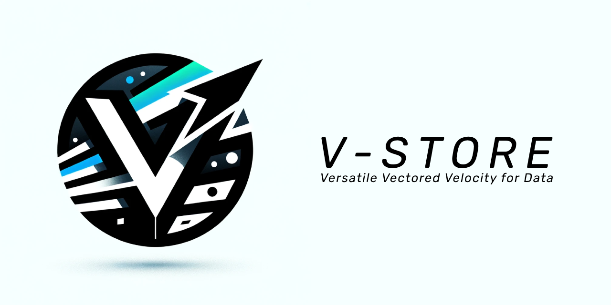

----
VStore DB
===========================

VStore, short for Vector, Velocity, Vanguard (and other cool 'V' words), is a modern, encrypted, and extensible database application designed to store, retrieve, and manage data efficiently. Built with a blend of Go and Python technologies, it showcases the power of combining robust backend functionality with an interactive front-end interface, providing a seamless user experience.

Features
--------

*   **Encryption**: Ensures data confidentiality with AES encryption, securing your data at rest.
*   **Ultra-efficient Compression**: uses LZW compression to make your persistent database really small yet blazingly fast
*   **In-memory Search Index**: Offers fast retrieval capabilities through an in-memory search index, supporting both exact and fuzzy searches.
*   **Extensible Data Model**: Flexible data structures allow for the storage and query of various data types, making it suitable for a wide range of applications.
*   **Real-time Updates**: Utilizes WebSockets for real-time data updates, enhancing interactive user experiences.
*   **Comprehensive API**: Features a RESTful API for data operations, including CRUD actions, search, and more, facilitating integration with external systems.

Architecture
------------

VStore comprises two main components:

1.  **Backend**: Written in Go, it handles data storage, encryption, search indexing, and API services. It employs a custom in-memory database structure for quick data access and modifications. The backend also features a Go-based HTTP server that interacts with the database through a defined API for managing data operations.
    
2.  **Frontend**: Developed with Flask and Socket.IO in Python, the frontend provides a web-based interface for interacting with the database. It communicates with the backend via a WebSocket connection, allowing for real-time data operations and updates.
    

How It Works
------------

### Under the Hood

*   **Encryption**: Data is encrypted using AES-GCM, with keys derived from SHA-256 hashed passwords. This ensures that stored data is secure and protected from unauthorized access.
*   **Data Storage**: Utilizes an in-memory data structure for storing and managing data, offering rapid access and manipulation capabilities. Data is serialized using GOB encoding before being compressed and encrypted for disk storage.
*   **Search Indexing**: Implements an inverted index for efficient search operations, enabling both exact and fuzzy searching through tokenized data matching.
*   **Real-time Communication**: Leverages WebSockets for real-time communication between the client and server, facilitating instantaneous data updates and notifications.

### Extensibility

VStore's modular architecture and use of standard data encoding/encryption techniques make it highly extensible:

*   **Custom Data Types**: The GOB encoding allows for the serialization of nearly any data type, enabling the storage and retrieval of complex structures.
*   **Scalability**: The in-memory data structures and indexing strategies can be expanded or replaced to accommodate scaling requirements, such as distributed data storage systems or integration with external databases.
*   **Security Enhancements**: The encryption module can be upgraded to include additional security measures, such as key rotation and multi-factor authentication.
*   **API Expansion**: The RESTful API can be extended to include more endpoints and functionalities, catering to the evolving needs of applications.

Getting Started
---------------

### Prerequisites

*   Go (version 1.14 or later)
*   Python (version 3.6 or later)
*   Flask
*   Flask-SocketIO
*   Requests library

### Installation

1.  **Clone the Repository**

sh

`git clone <repository-url> cd VStore`

2.  **Set Up the Go Backend**

Navigate to the Go directory and build the project:

sh

`cd go go build ./vstore`

3.  **Set Up the Flask Frontend**

In a new terminal, navigate to the Python directory and install dependencies:

sh

`cd python pip install flask flask-socketio requests`

Start the Flask application:

sh

`python client/client.py`

### Usage

Open a web browser and navigate to `http://localhost:5111` to access the VStore web interface. Here, you can perform various database operations such as adding, updating, and deleting records, as well as searching and querying the database in real-time.

Tutorials
---------

1.  **Adding a Record**: Click on the "Add Record" button, fill in the key and value fields, and submit.
2.  **Searching for Records**: Use the search bar to enter your search query and click on "Search". For fuzzy searches, tick the "Fuzzy Search" checkbox.
3.  **Updating a Record**: Select a record from the list, modify its value in the provided input field, and click "Update".
4.  **Deleting a Record**: Click the "Delete" button next to the record you wish to remove from the database.

For more detailed tutorials and information, please refer to the official documentation available in the `docs` folder.

Contribution
------------

VStore welcomes contributions from the community. Whether you're interested in fixing bugs, adding new features, or improving the documentation, your help is appreciated. Please refer to the `CONTRIBUTING.md` file for contribution guidelines.

License
-------

VStore is open-source software licensed